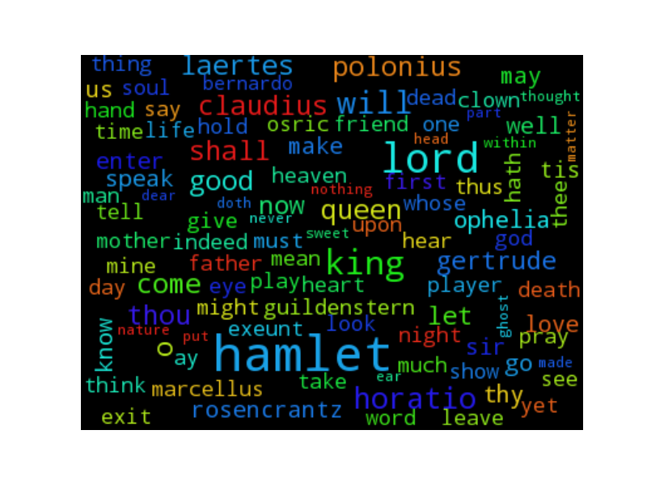

# generate-word-cloud.py
A simple Python 2 :snake: script to generate a square wordcloud :cloud: from one or more text files.


> Based on the great [word_cloud](https://github.com/amueller/word_cloud/) module by [@amueller](https://github.com/amueller/).

----

## How to use it?
### Installation
Clone the repository, copy the [script (generate-word-cloud.py)](./generate-word-cloud.py) somewhere in your PATH.

> Note: The script is *not yet* available from [pip](http://www.pip-installer.org/). It will be, soon.

### Usage
#### Help:
```bash
$ generate-word-cloud.py --help
```
#### From one or two files
Generate a wordcloud from two `txt` files in the current directory, save it to `wordcloud_txt.png`.

```bash
$ generate-word-cloud.py -o ./wordcloud_txt.png ./file1.txt ./file2.txt
```

Generate a wordcloud from the textfile `hamlet.txt` (~ 8000 lines), saving to `hamlet.png`:

```bash
$ generate-word-cloud.py -o ./hamlet.png ./hamlet.txt
```


(It should work on pretty big text files without any issue)

----

## Other examples
### From a lot of Python scripts (~ 200)


### From a lot of Bash scripts (~ 150)


### From a lot of LaTeX scripts (~ 180)


### Meta example
Generate a wordcloud from the [README.md](./README.md) and [generate-word-cloud.py](./generate-word-cloud.py) files **of this very project**, save it to `wordcloud_meta.png`!

```bash
$ generate-word-cloud.py -o ./wordcloud_meta.png ./*.md ./*.py
```


----

## Features
- [x] Support one or more input files, will skip the one it fails to find or fails to read,
- [x] Customize output file, won't be overwritten (except with `-f` flag),
- [x] Nice command line interface ([argparse](https://docs.python.org/2.7/library/argparse.html) powered),
- [x] Has a command line option for every important parameter (max nb of words, width, height etc).

----

## Complete documentation (`--help`)
```
generate-word-cloud.py -h
usage: generate-word-cloud.py [-h] [-v] [-s] [-f] [-o OUTFILE] [-t TITLE]
                              [-m MAX] [-w WIDTH] [-H HEIGHT]
                              INFILE [INFILE ...]

optional arguments:
  -h, --help            show this help message and exit
  -v, --version         show program's version number and exit

  -s, --show            show the image but do not save it
  -f, --force           force to write the image, even if present (default is to ask before overwriting an existing file)
  -o OUTFILE, --outfile OUTFILE
                        filename for the generated image, default is 'wordcloud.png'
  -t TITLE, --title TITLE
                        title for the image, default is None
  -m MAX, --max MAX     max number of words to display on the cloud word
  -w WIDTH, --width WIDTH
                        width of the generate image
  -H HEIGHT, --height HEIGHT
                        height of the generate image
  INFILE                a text file to read
```

----

## TODO?
- [x] Start it, from [this example](https://github.com/amueller/word_cloud/blob/master/examples/simple.py),
- [x] Run it on some interesting examples, embed them here,
- [ ] Check on weird encodings?,
- [ ] Test it against :closed_book: VERY large files (million of line) ?,
- [ ] Test it against :books: LOTS of files (several thousands) ?,
- [ ] Write a small article about it for [my blog](http://perso.crans.org/besson/).

### Knows issues
- [ ] Input filenames with spaces in their name are seen as several files.

----

## About
### Why?
- I wanted a way to visualize the major keywords of Bash and Python (my two [favorite programming languages](https://wakatime.com/@lbesson)) and of Markdown/Strapdown, reStructuredText and LaTeX (my favorite typeset documents system),
- The original project [word_cloud](https://github.com/amueller/word_cloud/) seemed cool. And it is. Great job [@amueller](https://github.com/amueller/) :clap: !
- [Clouds of words are interesting](https://www.academia.edu/20224642/)!

### Author
> [Lilian Besson (Naereen)](https://github.com/Naereen/).

### [License](./LICENSE)
> [GPLv3 License](http://www.gnu.org/licenses/gpl.html).
