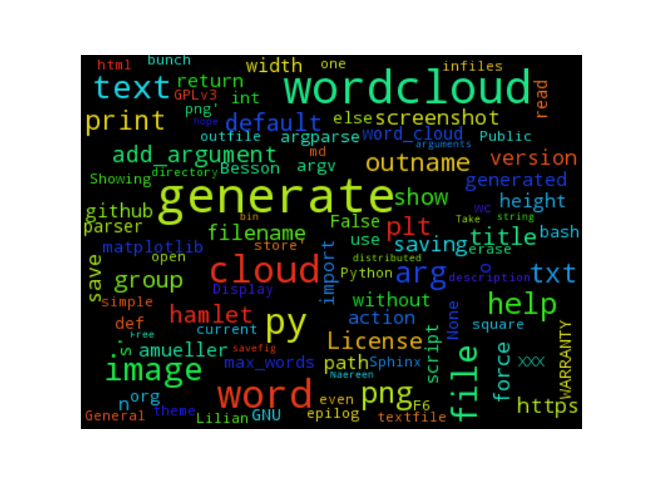
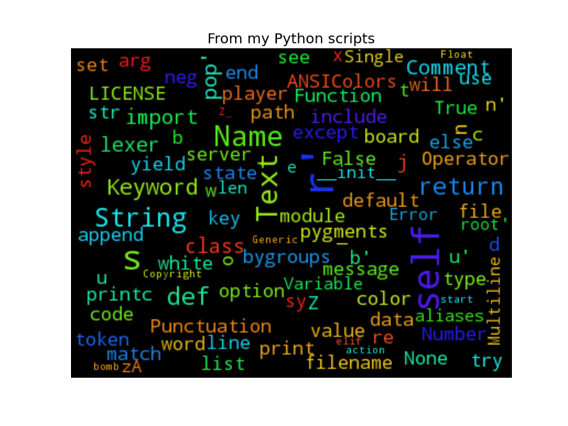
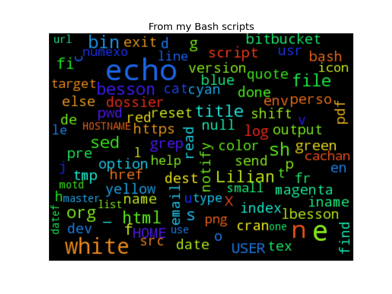
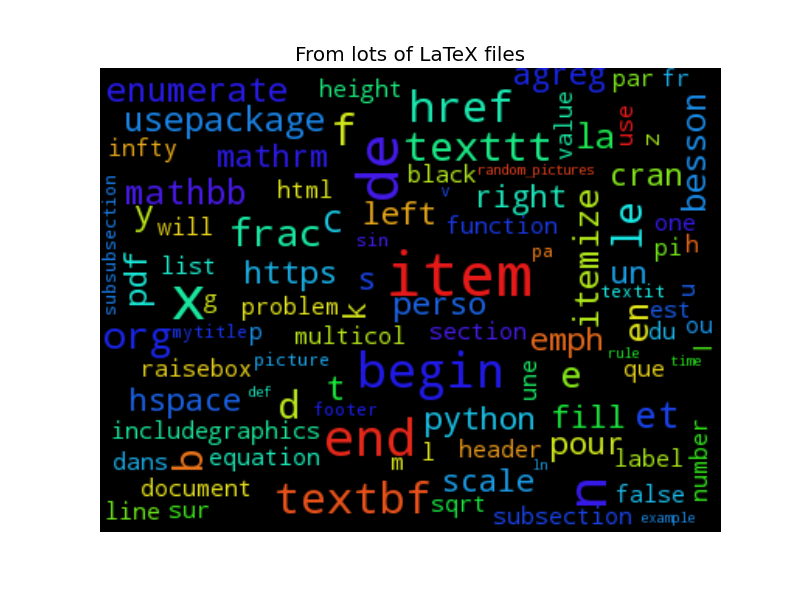

# generate-word-cloud.py
A simple Python 2 script to generate a square wordcloud from a file or a bunch of files.



Based on the great [word_cloud](https://github.com/amueller/word_cloud/) module by [@amueller](https://github.com/amueller/).

----

## How to use it?
### Installation
Clone the repository, copy the [script (generate-word-cloud.py)](./generate-word-cloud.py) somewhere in your PATH.

The script is *not yet* available from [pip](http://www.pip-installer.org/).

### Usage
#### Help:
```bash
$ generate-word-cloud.py --help
```
#### From one or two files
Generate a wordcloud from two `txt` files in the current directory, save it to `wordcloud_txt.png`.

```bash
$ generate-word-cloud.py -o wordcloud_txt.png ./file1.txt ./file2.txt
```

Generate a wordcloud from the textfile `hamlet.txt`, saving to `hamlet.png`:

```bash
$ generate-word-cloud.py -o hamlet.png ./hamlet.txt
```

(It should work on pretty big text files without any issue)

#### META EXAMPLE
Generate a wordcloud from all the [README.md](./README.md) and [generate-word-cloud.py](./generate-word-cloud.py) files of this project, save it to `wordcloud_meta.png`.

```bash
$ generate-word-cloud.py -o wordcloud_meta.png ./*.md ./*.py
```

----

## Screenshots
### From a lot of Python scripts




----

## About
### Authors?
- [Lilian Besson (Naereen)](https://github.com/Naereen/),

### [License?](./LICENSE)
> [GPLv3 License](http://www.gnu.org/licenses/gpl.html).
